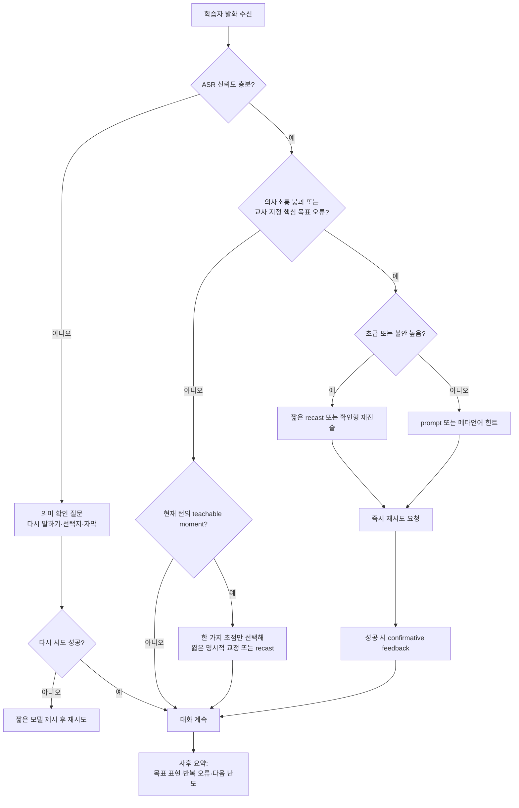
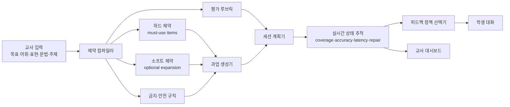

# 실시간 대화형 L2 회화튜터 설계 보고서

## 집행 요약

실시간 음성 대화형 AI 언어튜터의 효과는 “얼마나 사람처럼 말하느냐”보다 “얼마나 학습이 일어나도록 대화를 조직하느냐”에 더 크게 좌우된다. 제2언어습득 연구에서 상호작용은 입력, 의미협상, 산출을 묶는 핵심 메커니즘으로 간주되며, 과업중심언어교육과 기술매개 TBLT 연구는 기술의 affordance와 과업 설계가 맞아떨어질 때 학습 효과가 커진다고 본다. 따라서 좋은 AI 튜터는 자유대화형 챗봇이 아니라, 의미 중심 과업을 짧은 음성 턴 안에 배치하고, 학습자가 스스로 수정하고 다시 시도하게 만드는 “대화 오케스트레이터”여야 한다. citeturn30view1turn30view2turn30view3

피드백은 반드시 들어가야 하지만, 한 가지 방식으로 고정하면 안 된다. 교실 L2 연구는 학습자가 대체로 교사보다 더 많은 구두 교정을 원한다는 점, 그리고 피드백 유형마다 기능이 다르다는 점을 보여준다. 규칙 기반 문법 목표에는 산출 유도 프롬프트가 종종 recast보다 강한 효과를 보였고, 불안이 높은 학습자에게는 메타언어 피드백보다 recast가 더 안전할 수 있었다. 또한 피드백 시점에는 단일한 “정답”이 없으며, 연구 종합은 즉시·지연 피드백 모두 이점이 있음을 보여주고, 일부 복제연구는 구두 산출에서는 즉시 피드백 우위를 보고한다. 따라서 실시간 튜터는 **의사소통 붕괴 시 즉시 개입, 성공적 의미전달 중에는 최소 개입, 사후 요약에서 집약 피드백**이라는 조건부 정책으로 작동하는 편이 합리적이다. citeturn30view0turn30view6turn46search9turn46search10turn46search1

음성 대화라는 모달리티 자체가 설계를 바꾼다. 인간 대화의 턴 간 간격은 전형적으로 매우 짧고, 빠른 응답은 사회적 연결감과도 관련된다. 반면 최근 한국 EFL 맥락의 ChatGPT 역할극 종단연구는 AI의 과도한 장광설과 경직된 pause threshold가 상호작용 능력 발달의 제약요인이 될 수 있음을 보여준다. 따라서 음성 튜터는 긴 설명보다 짧은 백채널, 재시도 요청, 자기수정 기회, 그리고 빠른 턴 교대를 우선해야 한다. 여기에 시각·제스처 단서가 더해지면 이해도와 발음 평가가 달라질 수 있으므로, 초급자와 발음지도에서는 멀티모달 단서를 선택적으로 쓰되, “화려한 아바타”만으로 학습 향상이 보장되지는 않는다는 점을 전제로 해야 한다. citeturn16search0turn16search1turn16search5turn33view12turn31view1turn22search21

교사가 어휘, 표현, 문법, 주제를 지정하는 상황에서는 AI가 그것을 단순 프롬프트 문자열로 받으면 안 되고, **하드 제약, 소프트 제약, 과업 계획, 피드백 규칙, 평가 루브릭**으로 컴파일해야 한다. 동시에 현행 연구는 AI-교사 협업 설계가 아직 충분히 축적되지 않았고, 대화형 AI 연구 자체도 아직 초기 단계이며, 특히 최근 리뷰들은 근거가 아시아 EFL 맥락에 편중되어 있음을 지적한다. 따라서 제품화 단계에서는 학습효과 검증, 교사 대시보드, 인간 검토, 편향·프라이버시 점검이 필수이며, 한국 학교 맥락에서는 교육부의 AI 윤리원칙과 학습지원 소프트웨어 선정 기준, 개인정보보호위원회의 생성형 AI 개인정보 처리 안내를 함께 반영해야 한다. citeturn44search5turn33view9turn44search2turn17search0turn29search1turn29search12turn17search1turn17search2turn17search3

## 연구 범위와 해석상의 전제

이 보고서는 사용자가 우선순위로 제시한 사이트 순서를 따라 CALICO, Taylor & Francis, ScienceDirect, Cambridge, SAGE, Wiley, Benjamins를 먼저 탐색하고, 이후 Google, Academia.edu, ResearchGate를 발견용 보조 채널로 활용한 뒤, 다시 원저널/공식 문서로 회수하는 방식을 취했다. 초기 스코핑에서 CALICO 자료는 ASR 기반 즉시 피드백, iCALL, 구두평가와 관련된 field signal을 제공했지만, 본 보고서의 핵심 실증 근거는 더 안정적으로 메타데이터와 초록을 제공하는 peer-reviewed 저널과 공식 기관 문서에 두었다. citeturn6search14turn6search15turn6search7

학습자 세부 정보는 명시되지 않았으므로, 본 보고서는 **실시간 음성 대화**를 공통 전제로 삼고, 설계의 1차 분기 기준을 연령보다 **숙련도(proficiency)**에 둔다. 연령은 그 다음 안전·과업 길이·멀티모달 밀도·개입 강도를 조정하는 파라미터로 다루는 것이 합리적이다. 특히 ASR 발음 피드백은 18세 이상 및 중간 숙련도에서 상대적으로 잘 작동했고, 어린 학습자와 비원어민 아동 음성에는 인식 한계가 보고되었으므로, 미성년·초급 맥락에서는 더 짧은 턴, 더 높은 교사 가시성, 더 보수적인 자동교정이 필요하다. citeturn32view3

또 하나의 중요한 전제는 **증거의 일반화 가능성**이 아직 제한적이라는 점이다. 최근 대화형 AI 도구 리뷰는 2013년부터 2023년까지의 32편을 분석했는데, 포함 연구가 모두 아시아 EFL 맥락에서 수행되었다고 보고했다. 다른 리뷰들 역시 AI 대화시스템의 교육적 활용이 아직 초기 단계이며, 특히 의미 중심 커뮤니케이션·상호작용 능력·토론 및 문제해결 과업에 대한 강한 실험근거가 더 필요하다고 본다. 따라서 이 보고서의 권고안은 “현재까지 가장 타당한 설계 추론”이지, 모든 학습자군에 보편적으로 확정된 처방은 아니다. citeturn33view9turn44search2turn33view8turn33view10

한국어 자료를 우선할 수 있는 영역은 주로 **윤리·프라이버시·학교 도입 기준**이었다. 한국 교육부는 교육분야 AI 윤리원칙을 제시했고, 2025년에는 학교의 학습지원 소프트웨어 선정 기준을 발표했으며, 개인정보보호위원회는 2025년 생성형 AI 개발·활용을 위한 개인정보 처리 안내서를 공개했다. 따라서 국내 학교 도입은 “좋은 pedagogy”만이 아니라 “조달 기준·개인정보·평가 운영”까지 함께 설계해야 한다. citeturn29search1turn29search12turn17search0

## 문헌 종합

핵심 문헌을 종합하면, 효과적인 실시간 회화튜터는 네 가지 축을 동시에 만족해야 한다. 첫째, 의미 중심 상호작용을 지속적으로 생성해야 한다. 둘째, 학습자의 산출을 밀어 올리는 과업과 피드백이 있어야 한다. 셋째, 발음과 말하기 평가는 정확성 그 자체보다 **이해가능성(comprehensibility)과 상호작용성**을 함께 봐야 한다. 넷째, AI 고유의 약점인 지연, ASR 오인식, 과도한 발화 길이, 정서적 맥락 부족을 정책적으로 제어해야 한다. citeturn30view1turn30view2turn30view4turn33view7turn33view10turn33view12

| 연구 | 설계·학습자 | 피드백·과업 초점 | 주요 결과 | 튜터 설계 함의 | 근거 |
|---|---|---|---|---|---|
| Lyster, Saito, Sato | L2 교실 구두교정 종설 | OCF 유형, 빈도, 선호 | 학습자는 대체로 교사보다 더 많은 OCF를 원했고, OCF 유형별 기능이 다르다. | 피드백 강도와 유형을 고정하지 말고 학습자/교사 선호 프로필을 분리 저장해야 한다. | citeturn30view0 |
| Loewen & Sato | 상호작용주의 기반 ISLA 종설 | 입력, 의미협상, 산출 | 상호작용은 instructed SLA의 핵심 구성요소다. | 튜터는 질문-응답만 하지 말고 의미협상과 수정산출을 유발해야 한다. | citeturn30view1 |
| Pica | 정보격차 과업 방법론 논의 | information-gap task | 정보격차 과업은 학습자가 평상시 잘 못 보는 형식에 주의를 돌리게 할 수 있다. | 초·중급 회화튜터의 기본 task family로 information-gap을 포함해야 한다. | citeturn45search7 |
| Ammar & Spada | 64명, 캐나다 초등 상급 ESL | recast vs prompt vs 통제 | 서로 다른 숙련도 학습자에게 recast와 prompt의 잠재 이익을 비교한 준실험이다. | 피드백 정책은 proficiency-blind 방식이 아니라 숙련도 민감형이어야 한다. | citeturn30view5 |
| Lyster | SSLA 실험연구 | prompts vs recasts | 규칙 기반 문법 표적에서는 prompts가 recasts나 무피드백보다 더 효과적이었다. | 교사 지정 문법 목표가 규칙 기반일 때는 “prompt-first”가 기본값이 되어야 한다. | citeturn30view6 |
| Lambert, Kormos, Minn | SSLA, 구두 단일화 과업 반복 | task repetition | 과업 반복은 즉각적 L2 유창성 향상과 관련되었다. | 동일 시나리오를 약간 변형해 재수행시키는 loop를 설계해야 한다. | citeturn30view7 |
| Canals et al. / Li et al. 복제 | 영상기반 CMC, 52명 등 | immediate vs delayed CF | 즉시·지연 피드백 모두 학습 이점이 있을 수 있으며, 일부 복제에서는 구두산출에 즉시 피드백 우위가 보고되었다. | “항상 즉시” 또는 “항상 지연”이 아니라, 붕괴 여부와 과업 단계에 따른 조건부 timing 정책이 필요하다. | citeturn46search10turn46search1turn46search0 |
| Rassaei | L2 발달과 불안 연구 | metalinguistic vs recast | 저불안 학습자는 두 방식 모두에서 이익을 봤지만, 고불안 학습자는 recast에서 더 큰 이익을 보였다. | affect-sensitive feedback routing이 필요하다. | citeturn46search9 |
| Nassaji | Language Teaching 종설 | 상호작용 피드백 연구방법 | 피드백은 전반적으로 긍정 효과가 있으나, 다중 측정과 엄밀한 연구설계가 필요하다. | 제품 평가에서 단일 점수 하나로 학습효과를 주장하면 안 된다. | citeturn21search0turn30view4 |

| 연구 | 설계·학습자 | AI/모달리티 초점 | 주요 결과 | 튜터 설계 함의 | 근거 |
|---|---|---|---|---|---|
| Jeon, Lee, Choe | 37편 체계적 검토 | 음성인식 챗봇 | goal-orientation, embodiment, multimodality의 3축 틀과 8개 챗봇 유형을 제시했다. | 챗봇을 “LLM 하나”로 보지 말고 목표·체화·멀티모달 조합으로 설계해야 한다. | citeturn33view7 |
| Du & Daniel | 24편 speaking practice review | EFL 말하기 챗봇 | 말하기 결과, 자신감, 참여, 동기, 불안 완화 측면의 장점을 보고했다. | 회화튜터는 speaking gain뿐 아니라 affect gain을 함께 목표로 삼아야 한다. | citeturn33view8 |
| Lai & Lee | 32편 리뷰 | conversational AI in ELT | 포함 연구가 모두 아시아 EFL였고, quasi-experimental·mixed-method가 많았다. | 일반화에 신중해야 하며 제품 검증은 새로운 맥락에서 다시 해야 한다. | citeturn33view9 |
| Wiboolyasarin et al. | 30편 실증연구 리뷰 | AI-driven chatbot | speaking·writing에서 특히 개선이 두드러졌고, listening·reading은 더 깊은 맥락 상호작용 한계가 있었다. | spoken tutor는 회화와 산출 중심에 강점을 두되, listening은 별도 설계와 검증이 필요하다. | citeturn33view10 |
| Tai et al. | 85명, 대만 초등 6학년, 3주 summer program | GAI chatbot + ASR | 개별·짝봇 조건 모두 전통 수업보다 post-test speaking skill이 높았다. | 초등에도 가능하되, 짝 활동과 개별 활동 둘 다 선택지로 설계할 수 있다. | citeturn8search13 |
| Tai | 89명 대학 신입생, 한 학기 | Google Assistant 바깥수업 | 이동성·즉시 멀티모달 피드백·불안 감소·자기주도성이 구두 능력 향상에 기여했다. | 교실 밖 짧은 rehearsal 세션과 모바일 접근이 핵심이다. | citeturn34search1 |
| Ericsson et al. | 스웨덴 lower secondary 종단연구 | embodied spoken dialogue system | 학생들은 일상 시나리오에서 지속적으로 연습했고 사회·정서적으로도 대체로 긍정적 경험을 보고했다. | 청소년 대상에서는 일상 과업과 낮은 불안 환경이 중요하다. | citeturn33view11 |
| Choi & Oh | 한국 EFL 학습자 1인, 30회 role-play | ChatGPT-4 turn-taking | turn complexity, diversity, timing은 좋아졌지만 AI verbosity와 rigid pause thresholds는 제약으로 작용했다. | 실시간 튜터는 짧은 턴과 유연한 pause 정책이 필수다. | citeturn33view12 |
| Ngo, Chen, Lai | ReCALL 메타분석, 15편 38 effect sizes | ASR 발음 피드백 | 전체 효과는 중간 수준이었고, explicit corrective feedback가 indirect feedback보다 더 효과적이었으며, segmental에서 강하고 suprasegmental에서는 약했다. | 발음 피드백은 “오류 위치와 이유를 보여주는 명시적 피드백”을 우선하고, 운율 피드백은 보조적으로 다뤄야 한다. | citeturn32view0turn32view1 |
| Tsunemoto et al. | 60명 평가자, 20명 L2 화자 | visual cues in L2 speech assessment | 전체 비디오를 본 평가자는 화자를 더 comprehensible하고 덜 accented하게 평가했다. | 초급·발음지도에서는 얼굴·손짓·시각 단서를 선택적으로 활용할 가치가 있다. | citeturn31view1 |

이 표들에서 특히 중요한 결론은 세 가지다. 첫째, **과업 없이 자연대화만 늘리는 방식은 약하다**. 정보격차, 역할극, 반복 과업, 이야기 재구성 같은 구조가 있어야 의미협상과 수정산출이 생긴다. 둘째, **피드백은 유형과 타이밍을 조건부로 바꿔야 한다**. 규칙 기반 문법 목표에는 prompt가 강하고, 불안이 높거나 대화 흐름이 더 중요한 순간에는 recast가 더 안전하다. 셋째, **음성 AI의 특수문제**인 ASR 오인식, 지연, 장광설은 pedagogy 문제가 아니라 learning blocker다. 최근 JSLP 연구는 발음 피드백에서 “corrective feedback”뿐 아니라 “confirmative feedback”도 별도 설계 대상으로 다루고 있고, 상용 iOS 발음 앱 분석은 AI 통합 주장과 별개로 피드백의 부정확성을 경고한다. citeturn30view2turn30view6turn46search9turn32view0turn19search0turn19search6

## 권고 대화 정책과 알고리즘

실시간 음성 튜터의 기본 정책은 다음 한 문장으로 요약할 수 있다. **“의미를 먼저 통과시키고, 현재 학습목표와 발달가능성이 만나는 단 하나의 지점만 선택해, 자기수정을 우선 유도하고, 나머지는 사후 요약으로 보낸다.”** 이 방식은 상호작용주의 SLA, OCF 연구, task repetition 연구, 그리고 최근 음성대화 AI 연구를 모두 가장 자연스럽게 연결한다. citeturn30view1turn30view0turn30view7turn33view12

| 차원 | 권고 설계 | 왜 이렇게 해야 하는가 | 근거 |
|---|---|---|---|
| 숙련도 | 초기 한두 분의 탐색 질문과 수행 로그로 CEFR/ACTFL 근사치를 잡고, 초급은 짧은 턴·좁은 목표·선택지 지원, 중급은 개방 질문과 반복 과업, 상급은 토론·문제해결·담화전략으로 이동한다. | proficiency가 과업 성과와 피드백 해석 가능성을 좌우한다. | citeturn20search0turn20search1turn32view3turn45search21 |
| 연령 | 연령 미상일 때는 읽을 수 있는 청소년~성인을 기본값으로 잡되, 아동 모드에서는 세션 길이 축소, 화면 단서 증가, 교사/보호자 가시성 강화, 자동교정 강도 완화가 필요하다. | 어린 학습자 음성은 ASR 한계가 크고, 법·안전 요건도 더 엄격하다. | citeturn8search13turn33view11turn32view3turn17search3 |
| L1 배경 | L1을 미리 가정해 교정을 설계하지 말고, 반복 오류와 발음 패턴을 로그로 축적해 사후에 transfer 가설을 세운다. | 상호작용 설계의 1차 분기 기준은 숙련도와 현재 수행이며, L1-specific 개입은 관찰된 증거가 있을 때만 정밀화하는 편이 안전하다. | citeturn30view1turn30view4 |
| 상호작용 모달리티 | 음성 대화에서는 “짧은 acknowledgement 먼저, 완전 응답은 그 다음” 원칙을 둔다. ASR가 불확실하면 교정 전에 반드시 meaning check를 한다. | 인간 대화의 턴 간격은 짧고, 지연과 오교정은 자연성과 신뢰를 급격히 떨어뜨린다. | citeturn16search0turn16search1turn16search5turn32view0 |
| 피드백 유형 | 명시적 교정은 의미붕괴·교사 지정 핵심오류·반복 고착 오류에만 쓴다. recast는 흐름 유지와 고불안 상황에, prompt는 자기수정 유도와 규칙 기반 목표에, 메타언어 피드백은 중급 이상 또는 사후 요약에서 쓴다. | 피드백 유형마다 cognitive load와 affective cost가 다르다. | citeturn30view0turn30view6turn46search9 |
| 오류 처리 전략 | 한 턴에서 한 초점만 교정한다. 의미전달이 성공한 비핵심 오류는 누적했다가 post-task brief로 처리한다. 발음 교정은 ASR high-confidence일 때만 자동으로 내고, 그렇지 않으면 재시도나 교사 검토로 보낸다. | 과교정은 회화 흐름과 동기를 해치고, 전사형 ASR는 오류 위치를 잘못 짚을 수 있다. | citeturn32view0turn32view1turn19search6turn8search9 |
| 과업 유형 | role-play는 기능 표현과 프래그마틱 routine, information-gap은 질문·청취·정확성, storytelling은 담화 길이·연결어·prosody를 키우는 데 쓴다. 같은 목표를 다른 task family로 반복 가능하게 설계한다. | 과업 종류가 산출 형태와 주의 초점을 바꾼다. | citeturn45search7turn30view2turn45search8turn33view11turn45search12 |
| 스캐폴딩과 페이딩 | pre-task에서 핵심 어휘 3~7개, 모델 표현 1~3개, 시각 단서 1개를 주고, 본과업에서는 힌트를 줄이며, 마지막 재수행에서 힌트 없는 생산으로 옮긴다. | pre-task 지원과 과업 반복은 학습 부담을 낮추면서도 생산성을 높인다. | citeturn45search1turn30view7turn30view3 |
| 적응 난이도와 개인화 | 최근 3~5개 턴의 성공률, 목표표현 사용률, 이해 실패 수, 긴 침묵, 반복 요청을 보고 난도를 올리거나 내린다. | task type·proficiency·working memory 차이가 수행과 engagement를 바꾼다. | citeturn45search21turn28search15turn28search14 |
| 교사 지정 제약 | 어휘·문법·주제를 문자열이 아니라 하드 제약(반드시 유도), 소프트 제약(가능하면 확장), 금지 규칙, 평가 항목으로 분해한다. | TMTBLT는 기술 affordance와 과업 매칭을 요구하고, AI-교사 협업 연구는 아직 빈약하다. | citeturn30view3turn44search5turn23search0 |
| 턴테이킹과 수리 | 침묵이 길면 곧바로 정답 제시를 하지 말고 “다시 말해도 좋아”, “천천히 해도 돼”, 선택지 제시 같은 repair-initiation으로 자기수정을 돕는다. AI가 길게 설명하는 모드는 금지한다. | 인간 대화는 빠른 턴교대와 self-repair 선호를 보이며, AI verbosity는 제약 요인으로 드러났다. | citeturn16search1turn16search11turn33view12 |
| 멀티모달 단서와 타이밍 | 초급과 발음지도에서는 입모양, 얼굴, 제스처, 간단한 그림, 캡션을 선택적으로 쓰고, 상급에서는 시각 자료를 정보밀도 높은 task support로만 쓴다. 시각 단서는 선행·동시·사후 중 과업 목적에 맞춰 배치한다. | visual cue는 comprehensibility 판단을 바꾸고, 멀티모달 챗봇은 affordance가 크지만 embodiment alone은 충분조건이 아니다. | citeturn31view1turn33view7turn22search21turn22search15 |

다음 흐름도는 위 문헌을 바탕으로 정리한 **실시간 1턴 단위 의사결정 정책**이다. 핵심은 “ASR 신뢰도 확인 → 의미 붕괴 여부 판단 → 자기수정 우선 → 한 턴 한 초점 → 사후 요약 집약”이다. citeturn32view0turn46search10turn33view12

이 정책을 구현할 때 가장 중요한 세부 규칙은 다섯 가지다. 첫째, **meaning before form**이다. 의미가 전달되지 않으면 form feedback도 잘 먹지 않는다. 둘째, **one-focus rule**이다. 한 턴에서 모든 오류를 잡으면 회화가 수업이 아니라 심문이 된다. 셋째, **self-repair first**다. 가능하면 학습자가 고치게 하고, 실패했을 때만 모델을 준다. 넷째, **ASR confidence gating**이다. 발음·어휘 교정은 기계가 확신할 때만 낸다. 다섯째, **post-task bundling**이다. 즉시개입이 필요 없던 오류는 과업 후 20~40초짜리 summary coach turn으로 모아준다. 이 다섯 규칙이 합쳐질 때, 튜터는 자연스러운 회화를 유지하면서도 학습 성과를 놓치지 않는다. citeturn30view1turn30view6turn32view0turn46search9turn46search10

## 교사 설정값의 파라미터화

교사 주도형 설정은 단순히 “이 표현들을 써 줘”라는 시스템 프롬프트보다 훨씬 정교하게 다뤄져야 한다. 이유는 두 가지다. 첫째, 기술매개 TBLT 관점에서는 과업과 기술 affordance의 매칭이 핵심이기 때문이다. 둘째, AI-교사 협업에 관한 체계적 검토는 아직 인간과 AI의 역할 분담이 충분히 정립되지 않았음을 보여주며, 실제 학습자 사례 연구도 챗봇의 정서적 한계와 부정확한 정보 문제 때문에 **blended teacher-AI model**을 선호하는 경향을 보고한다. citeturn30view3turn44search5turn34search14

| 교사 입력 항목 | 입력 예시 | 시스템 내부 변환 | 프롬프트·과업 매핑 |
|---|---|---|---|
| 수업 목표 | “식당에서 주문하기”, “과거시제로 여행 이야기하기” | 세션 목적, success criterion, 평가 루브릭 항목으로 변환 | role-play, narrative recount, info-gap 중 적합한 과업군 선택 |
| 숙련도 가정 | “A1 추정”, “중2 수준”, “B1 근처” | 턴 길이, 문장 복잡도, 힌트 밀도, repair 허용치 조정 | 질문 형태, 선택지 유무, 후속 질문의 개방도 제어 |
| 필수 어휘 | menu, appetizer, dessert / missed, delayed, transfer | 하드 lexical agenda로 저장 | 세션 초반 과업 맥락에 필수 삽입, 최소 사용 quota 추적 |
| 필수 표현 | “I’d like…”, “Could you repeat that?”, “In my opinion…” | formulaic sequence tracker | 모델 문장, recast 후보, 사후 요약 카드 생성 |
| 문법 목표 | count/noncount, past tense irregulars, hedging, conditionals | 오류 탐지 규칙과 우선순위 테이블 생성 | prompt-first 또는 recast-first 정책 연결 |
| 주제 영역 | 병원 접수, 여행 일정, 학교 행사, 면접 | domain ontology와 금지 주제 체크 | 시나리오 생성, 정보격차 자료, 그림·키워드 선택 |
| 선호 과업 | role-play, information gap, storytelling | task family 가중치 설정 | 메인 과업과 반복 과업의 형태 결정 |
| 피드백 정책 | “발화 중 중단 최소화”, “문법은 꼭 잡기”, “발음은 사후만” | timing matrix와 intervention threshold 생성 | 실시간 개입 빈도와 사후 요약 밀도 조절 |
| 멀티모달 지원 | 그림 사용, 캡션 on, 입모양 영상 예시 | modality plan 생성 | 초급 시각 단서, 상급 정보 그래픽, 발음 시 mouth cue 연결 |
| 평가 증거 | 녹음 저장 여부, 체크리스트, 사용 어휘 보고 | learning analytics schema 생성 | 교사 대시보드, 세션 리포트, 루브릭 표시 |
| 안전·프라이버시 | 저장 금지, 미성년, 민감 주제 금지 | data retention·redaction·blocked-topic 규칙 생성 | 음성 저장 제한, 로그 익명화, 민감 장면 회피 |

이 입력은 다음과 같이 **제약 컴파일러**를 거쳐 세션 계획과 실시간 개입 정책으로 변환되는 편이 가장 안정적이다. citeturn30view3turn44search5

아래 예시는 같은 시스템이 숙련도와 교사 제약에 따라 어떻게 다르게 말해야 하는지 보여주는 **합성 시나리오**다.

**초급 예시**

교사 제약: 필수 표현 “I’d like… / Can I have…?”, 필수 어휘 “salad, soup, water”, 문법 목표 count/noncount, 과업 유형 role-play.

> **AI**: 안녕, 나는 식당 직원이야. 오늘은 세 가지만 꼭 써 보자. **I’d like…**, **Can I have…?**, 그리고 **water**. 화면에 메뉴를 보여 줄게.
> **Learner**: I want soup and a water.
> **AI**: 좋아, 거의 맞았어. **Can I have soup and water?** 라고 다시 말해 볼래?
> **Learner**: Can I have soup and water?
> **AI**: 좋아. 이제 **I’d like a salad**도 한 번 써 보자.
> **Learner**: I’d like a salad.
> **AI**: 아주 좋아. 그럼 내가 못 들은 척할게. **Could you repeat that?** 라고 먼저 말하고 다시 주문해 봐.

이 예시에서 AI는 목표 표현을 좁게 제한하고, 오류가 있어도 한 번에 하나만 잡으며, 명시적 교정보다 **짧은 모델 + 재시도**를 택한다. 이는 초급자의 인지부하를 낮추고, formulaic sequence를 빠르게 proceduralize하는 데 유리하다. citeturn30view6turn30view7turn33view11

**중급 예시**

교사 제약: 주제 “공항 지연”, 필수 과거시제 동사 “missed, waited, called”, 과업 유형 information-gap, 피드백 정책 “대화 중 중단 최소화, 사후 문법 요약”.

> **AI**: 네가 가진 항공편 정보와 내가 가진 안내 화면이 달라. 서로 물어보면서 무슨 일이 있었는지 맞춰 보자.
> **Learner**: My flight miss because I wait too long in security.
> **AI**: 음, 네 비행기를 놓쳤구나. 왜 그렇게 오래 기다렸어?
> **Learner**: I waited one hour, then I called my mom.
> **AI**: 좋았어. 그럼 지금까지를 한 문장으로 다시 말해 줘. **missed, waited, called**를 모두 넣어서.
> **Learner**: I missed my flight because I waited one hour in security and called my mom.
> **AI**: 좋아. 방금 이야기에서는 의미 전달은 아주 잘 됐고, 과거시제 하나만 더 매끄럽게 만들 수 있었어. 마지막에 내가 짧게 정리해 줄게.

여기서는 대화 중간에 즉시 끊지 않고, **의미협상 → 재산출 요청 → 사후 요약**으로 간다. 정보격차 과업은 질문과 청취를 강하게 만들고, 중급자에게는 이 구조가 듣기와 말하기를 동시에 밀어 올리기 좋다. citeturn45search7turn30view7turn46search10

**상급 예시**

교사 제약: 주제 “학교 AI 정책”, 필수 표현 “From my perspective… / I partly agree, but… / The trade-off is…”, 과업 유형 문제해결 토론, 피드백 정책 “담화전략 중심, 메타언어는 사후”.

> **AI**: 오늘은 토론이야. 너는 “학교에서 모든 AI 대화기록을 저장하면 안 된다”는 입장을 맡아 줘. 세 표현을 자연스럽게 써 보자.
> **Learner**: From my perspective, full storage is not necessary. It can help assessment, but privacy is more important.
> **AI**: 좋아. 나는 반대 입장을 맡을게. 기록이 없으면 교사가 학습근거를 볼 수 없다고 생각해.
> **Learner**: I partly agree, but the trade-off is student trust. If students think every sentence is stored, they will speak less freely.
> **AI**: 좋은 논지야. 이제 네 주장을 한 단계 더 정교하게 만들자. 상대 입장을 먼저 요약한 뒤 반박해 봐.
> **Learner**: You are saying records help teachers evaluate progress. I partly agree, but the trade-off is student trust and willingness to communicate.
> **AI**: 훨씬 좋아졌어. 마지막에 네 발화에서 hedging과 turn-design을 짧게 피드백할게.

상급자에게는 정확성 하나보다 **turn design, hedging, 반론 처리, 논지 연결**이 더 중요해진다. 최근 AI 대화시스템 리뷰가 상급 단계에서 의미 중심 커뮤니케이션, 토론, 문제해결 과업을 강조하는 것도 같은 맥락이다. citeturn44search2turn33view12

## 평가와 실험 설계

좋은 회화튜터는 “학생이 말을 더 많이 했다” 정도로 평가하면 안 된다. 최근 언어평가 연구는 AI 기반 말하기 평가를 개발할 때도 **실용성, 품질, 윤리**를 함께 봐야 한다고 강조한다. 또한 CEFR와 ACTFL는 모두 말하기를 암기된 문장 재현이 아니라 **실제 상황의 자발적·비연습적 사용**으로 본다. 따라서 평가 프레임은 최소한 **말하기 능력, 상호작용 능력, 발음/이해가능성, 듣기 이해, 정서 요인, 시스템 품질, 공정성/프라이버시**를 동시에 다뤄야 한다. citeturn21search4turn20search0turn20search1turn20search9

| 평가 영역 | 핵심 지표 | 측정 방식 | 권장 해석 |
|---|---|---|---|
| 전반적 말하기 숙련도 | CEFR spoken interaction / ACTFL speaking can-do | 인간 평가자 2인 이상 + 표준화된 역할극·설명·토론 과업 | 과업 특이 점수와 전체 숙련도를 분리 보고 |
| 상호작용 능력 | turn complexity, diversity, timing, repair success | 대화 로그 분석 + conversation analysis 표본 코딩 | “얼마나 많이 말했는가”보다 “얼마나 상호작용적으로 말했는가”를 본다. |
| CAF | complexity, accuracy, fluency | 과업 전후 및 지연 사후의 말뭉치 분석 | task repetition/feedback 효과를 보기 위한 기본 축 |
| 발음·이해가능성 | comprehensibility, intelligibility, segmental/suprasegmental | 인간 평가 + ASR 보조지표 | accent reduction보다 쉽게 이해되는지를 우선 본다. |
| 듣기 | comprehension check 성공률, 요약·재진술 정확도, 독립 listening test | 대화 내 embedded listening + 별도 listening task | 음성튜터가 듣기에도 실제로 기여하는지 분리 측정 |
| 정서 | anxiety, willingness to communicate, self-efficacy, engagement | 짧은 세션 후 척도 + 면담 | 단기 speaking gain이 없어도 불안 감소는 중요한 선행 성과일 수 있다. |
| 시스템 품질 | 응답 지연, ASR confidence, false correction rate, barge-in failure | 서버 로그, 오프라인 라벨링 | pedagogy failure와 system failure를 구분한다. |
| 공정성·거버넌스 | accent group 격차, 연령 격차, 저장/동의 이행률 | subgroup audit + privacy audit | 정확도보다 먼저 “누구에게 불리한가”를 본다. |

근거는 각각 다음과 같이 연결된다. 말하기 수준 서술자는 CEFR와 ACTFL가 제공하는 can-do 체계를 따르는 것이 가장 안정적이고, 상호작용 능력의 장기 추적은 최근 한국 EFL 종단연구가 제안한 turn complexity/diversity/design/timing 틀과 잘 맞는다. CAF와 task repetition은 기존 SSLA 연구가 안정적으로 사용해 온 축이며, 발음은 ASR score만으로 보지 말고 human comprehensibility judgment와 함께 봐야 한다. 듣기는 과업 내 확인 질문과 별도 listening measure를 같이 써야 하고, 정서 지표는 챗봇 연구들이 반복적으로 보고한 자신감, 불안, 참여 변화를 포착하는 데 필요하다. citeturn20search0turn20search1turn33view12turn30view7turn31view1turn32view0turn45search2turn33view8turn34search1

| 제안 실험 설계 | 답하려는 질문 | 표본·기간 예시 | 비교 조건 | 주요 결과지표 | 참고할 선행 근거 |
|---|---|---|---|---|---|
| 군집 무선배정 교실실험 | AI 튜터가 일반 수업 대비 speaking/listening을 높이는가 | 학급 단위 8~12주 | AI 통합 수업 vs 기존 수업 | CEFR/ACTFL speaking, listening, anxiety, usage logs | 초등 챗봇 개입, lower secondary SDS 통합 사례가 유사 출발점이다. citeturn8search13turn33view11 |
| 교차설계 비교실험 | 어떤 피드백 정책이 더 나은가 | 같은 학습자 4~6주 | prompt-first vs recast-first vs delayed-summary-first | target accuracy, uptake, WTC, false correction rate | OCF와 timing 연구가 직접적 비교 틀을 제공한다. citeturn30view6turn46search10turn46search0 |
| 미시 무작위화 실험 | 한 턴 단위 피드백 타이밍/형식이 누적 학습에 미치는 효과는 무엇인가 | 세션 수백 건 | 즉시개입 vs 사후요약 vs 확인형 재진술 | uptake, repair success, retention, affect | timing에 단일 정답이 없으므로 turn-level 실험이 필요하다. citeturn46search10turn46search6 |
| 종단 대화분석 사례연구 | turn-taking·repair·담화 전략이 어떻게 자라는가 | 20~30회 이상 반복 세션 | 동일 학습자 또는 소표본 추적 | turn timing, repair trajectory, discourse design | 한국 EFL ChatGPT 연구와 스웨덴 SDS 연구가 모델이 된다. citeturn33view12turn33view11 |
| 실용 현장검증 연구 | 교사가 설정값을 넣었을 때 실제 수업 운영성이 좋은가 | 교사 5~15명, 한 학기 | teacher dashboard on/off, hard vs soft constraints | 준비시간, 개입 빈도, 만족도, 채점 활용도 | AI-교사 협업 근거가 아직 약해 운영성 검증이 특히 중요하다. citeturn23search0turn44search5 |

평가 프로토콜은 세 층으로 운영하는 것이 좋다. **시스템 검증층**에서는 지연, ASR 오류, 잘못된 교정률을 먼저 본다. **학습효과층**에서는 speaking/listening/affect를 pre-post-delayed post로 측정한다. **수업실행층**에서는 교사의 준비시간, 설정값 사용성, 학생의 실제 참여 패턴을 본다. 피드백 연구가 다중 측정을 요구한다는 점을 고려하면, 이 세 층 중 하나라도 빠지면 제품은 “잘 돌아가는 시스템” 또는 “좋아 보이는 pedagogy” 중 하나만 될 가능성이 높다. citeturn30view4turn21search4

## 구현 로드맵과 운영 위험

실제 배포에서는 pedagogy 못지않게 **프라이버시·조달·책임성**이 중요하다. UNESCO는 교육과 연구에서 생성형 AI의 인간중심적 거버넌스를 강조하고, 한국 개인정보보호위원회는 생성형 AI 개발·활용 전 과정의 개인정보 처리 기준을 안내하고 있다. 한국 교육부는 교육분야 AI 윤리원칙과 학교의 학습지원 소프트웨어 선정 기준을 제시했고, 미국 학교 맥락에서는 FERPA, 13세 미만 온라인 서비스에는 COPPA가 관련된다. 따라서 음성튜터는 기본적으로 **데이터 최소수집, 보존 기본값 off, 교사/학교 단위 설정 가능, AI 사용 사실의 명시, 학습평가와 운영로그의 분리, 음성·전사·번역 로그의 차등 보관**을 원칙으로 삼아야 한다. citeturn17search1turn17search0turn29search1turn29search12turn17search2turn17search3

가장 실무적인 위험은 네 가지다. 첫째, 응답 지연이다. 인간 대화의 짧은 턴 간격을 생각하면, AI는 의미 있는 발화 전체를 즉시 만들지 못하더라도 최소한 짧은 acknowledgement를 먼저 내야 한다. 둘째, ASR 오교정이다. explicit feedback가 있을 때 ASR는 유의미하지만, 전사형 간접 피드백은 오류 위치를 잘못 알려 줄 수 있고, 어린 학습자·비표준 억양에서는 더 취약하다. 셋째, AI verbosity다. 실제 한국 EFL 종단사례는 pause threshold와 verbosity가 상호작용 능력을 제약한다고 보고했다. 넷째, 상용 발음 앱형 피드백의 부정확성이다. Benjamins의 최근 연구는 AI 통합 발음 앱이 제공하는 피드백이 빈번히 부정확할 수 있음을 지적한다. 따라서 음성튜터는 **짧게 말하고, 확신이 없으면 묻고, 확신이 높을 때만 고치고, 고친 뒤에는 반드시 다시 말하게 하는 구조**여야 한다. citeturn16search1turn16search5turn32view0turn32view1turn32view3turn33view12turn19search6

아래 로드맵은 **대상 언어 1개, 학교 파트너 1곳 이상, 기존 ASR/TTS 스택 활용**을 가정한 추정치다.

| 단계 | 핵심 산출물 | 기간 추정 | 인력 추정 | 종료 기준 |
|---|---|---:|---:|---|
| 발견과 기준선 정의 | 숙련도별 task library 초안, 교사 파라미터 스키마, 피드백 taxonomy, 평가 지표 정의 | 6~8주 | SLA 연구자 1, PM 1, 대화설계 1, 교사 자문 2명 내외 | 과업 30~50개와 teacher template가 합의되고, 실험 루브릭이 확정됨 |
| 음성 MVP 구축 | 실시간 음성 대화 루프, ASR confidence gating, one-focus feedback engine, 교사 설정 UI 베타 | 8~12주 | 엔지니어 3~4, 디자이너 1, 연구 1 | 목표 과업에서 안정적 턴교대, 허용 지연, false correction baseline 확보 |
| 파일럿 교실 통합 | 교사 대시보드, 세션 리포트, 사후 요약 카드, 로그 스키마, 프라이버시 옵션 | 8주 | 엔지니어 2, 리서처 2, 현장교사 5~10명 | 교사가 실제 수업에 넣어 사용 가능하고 준비시간이 수용 가능한 수준 |
| 효능 검증 | 군집실험 또는 교차실험, pre/post/delayed post, mixed-method 분석 | 1학기 | 연구책임 1, 데이터분석 1, 현장코디 1, 엔지니어 1 | speaking/listening/affect에서 통계적·교육적 효과 해석 가능 |
| 하드닝과 확장 | 편향감사, 연령별 안전정책, 다언어 확장, 조달 문서화, 운영 모니터링 | 8~12주 | ML/백엔드 2, 보안/프라이버시 1, QA 1, 연구 1 | 학교 도입 문서와 운영 규정이 완비되고, accent/noise subgroup audit 통과 |

| 주요 위험 | 현장 증상 | 우선 완화책 |
|---|---|---|
| 지연과 끊김 | 학생이 AI를 끊거나, AI가 겹쳐 말함 | acknowledgment first, 짧은 턴, end-of-turn 예측, 지연 시 hold cue |
| ASR 억양 편향 | 특정 억양·소음 조건에서 잘못된 교정 증가 | confidence threshold, 재확인 질문, subgroup audit, 발음 점수 human anchor |
| 과교정 | 학생이 위축되고 발화 길이가 줄어듦 | one-focus rule, 사후 요약 전환, 교사별 intervention density 조절 |
| 정보 부정확·정서 빈곤 | 학생이 챗봇을 믿지 않거나 인간 설명을 다시 요구 | teacher dashboard, blended debrief, 출처 기반 지식제약, 금지영역 설정 |
| 개인정보 과수집 | 음성·전사 로그 장기보관, 민감 데이터 유입 | 보존 기본값 off, redaction, 역할 기반 접근, 학교별 retention policy |
| 번역 의존 | 학생이 L1 번역에 기대고 L2 산출이 줄어듦 | MT는 비상 scaffold로 제한, 번역 사용 턴은 별도 표시, 생산성 점수와 분리 |

이 로드맵의 우선순위는 분명하다. 먼저 “더 똑똑한 모델”이 아니라 **더 좋은 과업 라이브러리와 피드백 정책**을 만들어야 하고, 그 다음에야 음성 스택을 붙여야 한다. 이유는 현재 근거가 말해 주듯, 회화 학습의 병목은 지식량보다도 대화 조직 방식, 피드백 선택, 그리고 교사와의 연결 방식에 있기 때문이다. citeturn30view2turn30view3turn44search5turn33view12